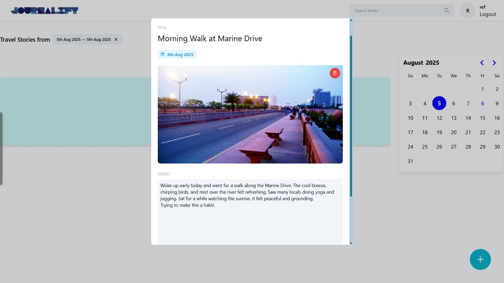
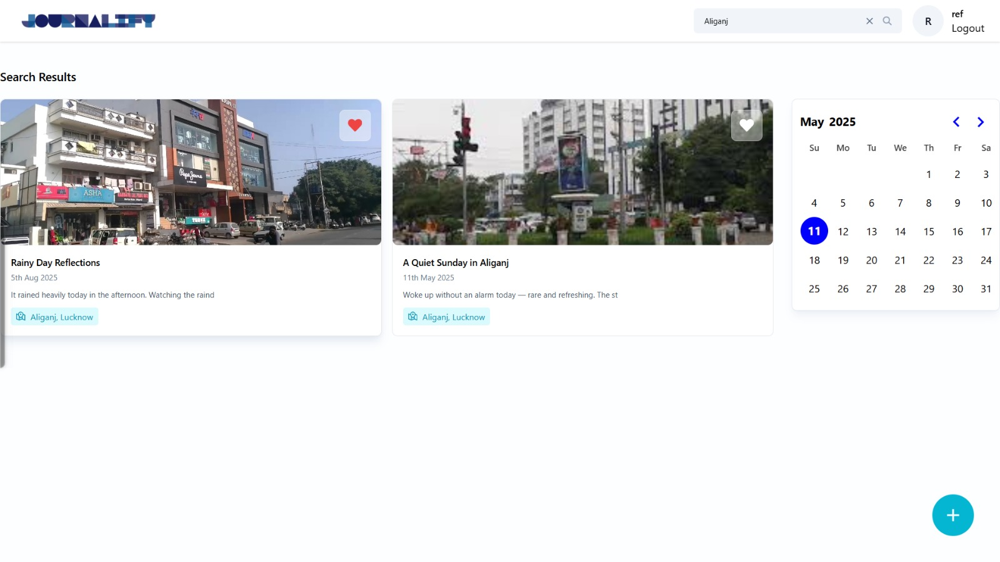
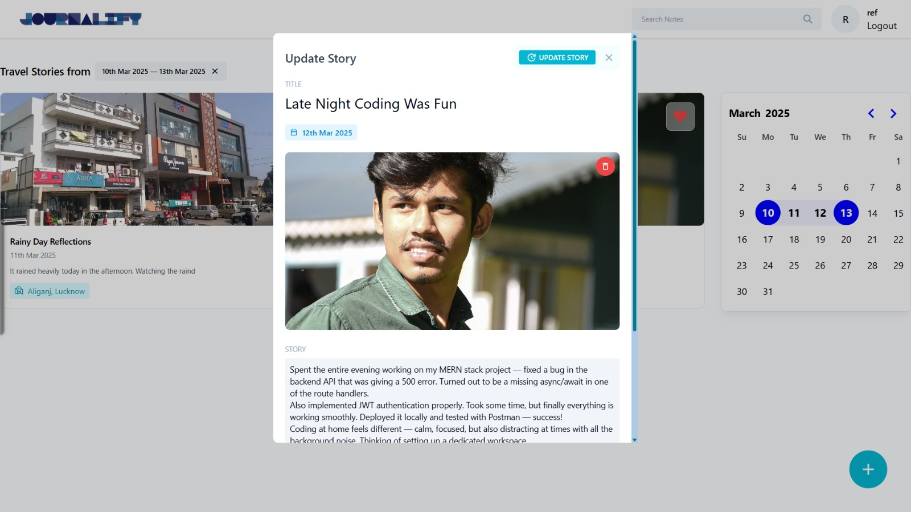

# 📝 Journalify

**Journalify** is a modern and intuitive MERN stack journaling web application that allows users to securely create, search, update, and manage daily journal entries. Whether it's reflecting on your day or tracking progress, Journalify helps you stay organized and mindful.

---

## 🚀 Features

- ✅ User Authentication (Login/Register)
- 📝 Create new journal entries
- 🔍 Search journals by date, range, or text
- 📅 Retrieve previous entries by date
- ✏️ Update existing journals
- 🧠 Clean and minimalist UI

---

## 🖼️ Screenshots

> _(Place your screenshots in the appropriate folder and adjust the paths below)_

### 🔐 Login Page

 <!-- Path: assets/Login.png -->

### ✍️ Create Entry Page

### 📆 View Journal by Date

### 🔎 Search Journals by Date Range

### 🔍 Search Journals by Text

### 🛠️ Update Existing Entry

---

## 🛠️ Tech Stack

- **Frontend**: React.js, Tailwind CSS
- **Backend**: Node.js, Express.js
- **Database**: MongoDB
- **Authentication**: JWT (JSON Web Tokens)
- **State Management**: useState, useEffect (React Hooks)
- **Deployment**: (To be added)

---

## 📂 Folder Structure

/Journalify
│
├── /frontend
│ ├── /components
│ ├── /pages
│ └── App.jsx
│
├── /backend
│ ├── /routes
│ ├── /controllers
│ └── server.js
│
└── README.md
